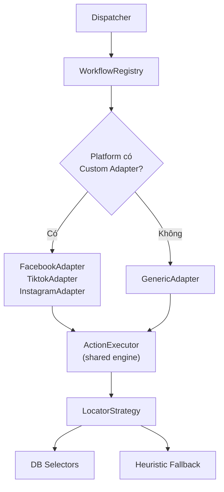

# Kế hoạch: No-Code GenericAdapter (v2 — Sau Review)

## Kiến trúc 3 tầng



**Nguyên tắc:**
- **GenericAdapter** = engine mặc định cho platform mới (breadth)
- **Custom Adapter** = giữ cho FB/TikTok/IG (depth), nhưng tái sử dụng ActionExecutor
- Custom adapter có thể gọi `ActionExecutor.execute_steps()` cho phần chung

---

## Thứ tự Build (7 bước)

### Bước 1: Chuẩn hóa Step Schema

```json
{
  "name": "fill_caption",
  "action": "fill",
  "selector_keys": ["caption:caption_input", "caption:text_area"],
  "value_source": "job.caption",
  "required": true,
  "timeout_ms": 10000,
  "wait_after_ms": 500,
  "retry_count": 1,
  "continue_on_error": false
}
```

Quy ước `value_source`:
- `job.caption`, `job.media_path` — trường từ Job
- `account.username` — trường từ Account
- `platform.base_urls.upload` — tra cứu PlatformConfig
- `literal:Post now` — giá trị cố định
- Bỏ trống = không cần value (cho click, wait, verify)

### Bước 2: ActionExecutor (shared engine)

#### [NEW] `app/adapters/generic/action_executor.py`

7 action types:

| Action | Input | Output |
|--------|-------|--------|
| `navigate` | url_key hoặc url literal | page.goto() |
| `click` | selector_keys[] | LocatorStrategy.resolve() → click |
| `fill` | selector_keys[] + value_source | resolve → fill/type |
| `upload_file` | selector_keys[] + value_source | resolve → set_input_files |
| `wait` | wait_ms | page.wait_for_timeout |
| `verify` | success_selector_keys[] + error_selector_keys[] | check DOM |
| `check_auth` | login_selector_keys[] + auth_selector_keys[] | SessionStatus |

Mỗi action thực thi log:
- step name, action, selector dùng, thời gian, kết quả, lỗi, screenshot nếu fail

### Bước 3: GenericAdapter

#### [NEW] `app/adapters/generic/adapter.py`

- `open_session()` → PlatformSessionManager.launch()
- `publish()` → load workflow steps từ DB → loop → ActionExecutor.execute()
- `close_session()` → cleanup
- Step-level logging + debug artifacts

### Bước 4: Sửa Dispatcher

- Khi `adapter_class = app.adapters.generic.adapter.GenericAdapter` → dùng GenericAdapter
- Auto-scaffold form tự động điền GenericAdapter thay vì adapter riêng

### Bước 5: Nâng UI Workflows (Phase 1 — Đơn giản)

- Mỗi step = 1 row: Tên | Action (dropdown) | Selector Keys | Value Source | Timeout | Required
- Nút `+ Thêm step`, `▲▼` di chuyển, `🗑 Xóa`, `📋 Duplicate`
- Validate config trước khi save

### Bước 6: Test Workflow + Logs

- Nút **"Test Workflow"** trên UI → dry-run với mock job
- Log từng step: pass/fail + screenshot nếu lỗi
- Hiển thị kết quả trực quan trên UI

### Bước 7: Workflow Versioning (nếu cần)

- Thêm cột `version` vào workflow_definitions
- Cho phép rollback workflow cũ

---

## Chiến lược platform

| Platform | Adapter | Lý do |
|----------|---------|-------|
| Facebook | Custom (giữ nguyên) | Edge case nhiều, đã ổn định |
| TikTok | Custom (vừa viết) | Upload flow đặc thù |
| Instagram | Custom (vừa viết) | Modal multi-step |
| Threads, Pinterest, Zalo... | **GenericAdapter** | No-code từ UI |

---

> [!IMPORTANT]
> Em sẽ bắt đầu từ **Bước 1 → 4** (Backend core) trước.
> Bước 5-6 (UI) sẽ làm sau khi engine chạy ổn.
> Anh duyệt em triển khai luôn nhé?
